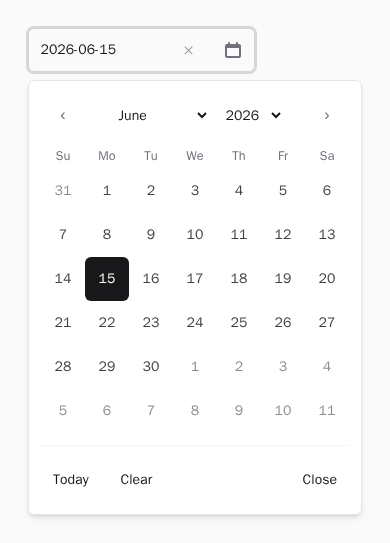
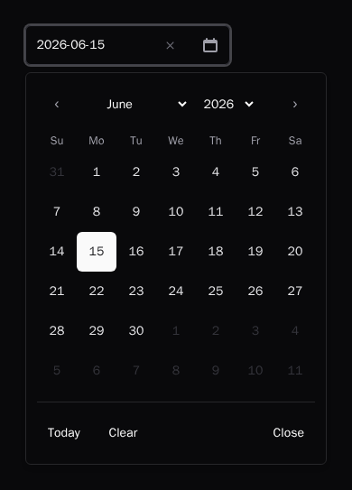
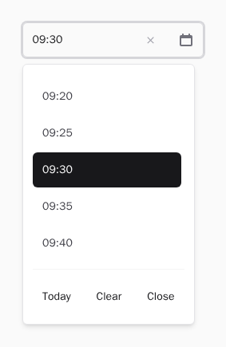
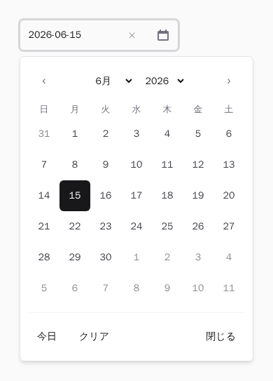
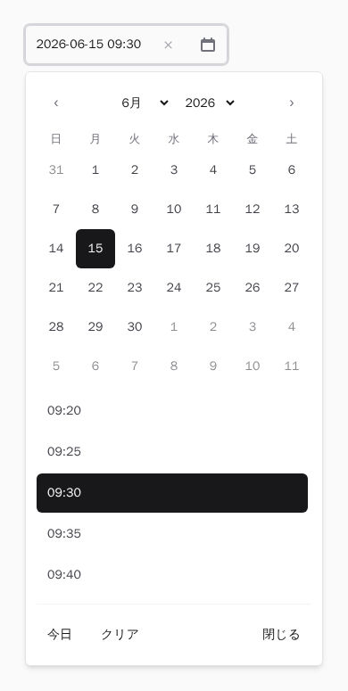

# Livewire Datepicker UI

A lightweight, **dependency-free** date / time / datetime picker for Laravel & Livewire.
Built on Alpine.js (the runtime Livewire already ships), authored in TypeScript,
styled with Tailwind, accessible by default, and with **optimistic UI updates**
that roll back automatically when the server rejects a value.

This package contains **no business logic** — no booking rules, no pricing, no
timezone conversion. It is purely the input UI, its state management, format
handling, validation helpers, Livewire integration, accessibility and theming.

---

## Screenshots

The default styling targets **Tailwind v4**, uses the **zinc** palette
(shadcn/ui-inspired) and sizes the popover controls to a **44×44px touch
target**. The text input keeps minimal default styling and is fully
customisable (see [Styling & theming](#styling--theming)).

| Date (light) | Date (dark) |
| :----------: | :---------: |
|  |  |

Hovering any day highlights its whole week row (the `week` slot), so scanning a
row is easier at a glance; the hovered day itself stays a shade darker:

| Date (hover) |
| :-----------: |
|  |

| Time | Datetime |
| :--: | :------: |
|  |  |

Localized UI (`locale="ja"`) — weekday/month names and the footer buttons follow
the active locale:

| Date (Japanese) | Datetime (Japanese) |
| :-------------: | :-----------------: |
|  |  |

These images are generated, not hand-made — regenerate them any time with
`make serve` + `make screenshots` (see [CONTRIBUTING](CONTRIBUTING.md)).

---

## Table of contents

- [Screenshots](#screenshots)
- [Features](#features)
- [Requirements & compatibility](#requirements--compatibility)
- [Development with Docker](#development-with-docker)
- [Installation](#installation)
- [Publishing config, views, translations & assets](#publishing)
- [Tailwind setup](#tailwind-setup)
- [Basic usage](#basic-usage)
- [Modes: date / time / datetime / month](#modes)
- [Formats](#formats)
- [Constraints: min / max / disabled](#constraints)
- [Localization](#localization)
- [Styling & theming](#styling--theming)
- [Dark mode](#dark-mode)
- [Optimistic UI & validation rollback](#optimistic-ui--validation-rollback)
- [Accessibility](#accessibility)
- [Timezone & date-only behaviour](#timezone--date-only-behaviour)
- [Props reference](#props-reference)
- [JavaScript API](#javascript-api)
- [Testing](#testing)
- [Browser support](#browser-support)
- [Security](#security)
- [Upgrade policy](#upgrade-policy)
- [FAQ](#faq)
- [Troubleshooting](#troubleshooting)

---

## Features

- **Four pickers** — `<x-date-picker>`, `<x-time-picker>`, `<x-date-time-picker>`,
  `<x-month-picker>` (plus the generic `<x-datepicker mode="…">`).
- **Separate display and submit formats** (`display-format` vs `value-format`).
- **Optimistic Livewire binding** with automatic rollback on server rejection and
  an `invalid` state on validation errors.
- **Constraints**: `min` / `max`, disabled dates, disabled weekdays, disabled time
  windows, minute step, 12/24-hour cycle — enforced identically on the client and
  the server.
- **Timezone-safe** date-only handling (no UTC day-shift bugs).
- **Full WAI-ARIA keyboard support** (combobox + dialog + grid).
- **Tailwind-first theming** — global class map, named themes, per-instance class
  overrides, and `data-*` state styling. Dark-mode ready.
- **No runtime dependencies** beyond Alpine (a peer dependency Livewire bundles).
  No jQuery, no date library.
- Ships **prebuilt ESM / IIFE** assets and is also importable from npm.

---

## Requirements & compatibility

| Package | PHP       | Laravel      | Livewire | Alpine |
| ------- | --------- | ------------ | -------- | ------ |
| 0.x     | 8.2 – 8.4 | 11 / 12 / 13 | 3 / 4    | 3      |

> PHP 8.2 cannot be combined with Laravel 13 (Testbench 11 requires PHP 8.3+).
> Every other combination in the table is covered by CI.

Tailwind CSS is expected to be present in the host project.

---

## Development with Docker

Everything runs inside Docker, so the host only needs **Docker** and **Docker
Compose** — no local PHP/Node/Composer/pnpm.

```bash
make build-images   # build the php + node images
make install        # composer install + pnpm install
```

| Command          | What it does                                              |
| ---------------- | -------------------------------------------------------- |
| `make test`      | PHP (Pest) + JS (Vitest)                                 |
| `make test-php`  | Pest only                                                |
| `make test-js`   | Vitest only                                              |
| `make serve`     | Start the Testbench workbench at `localhost:8000`        |
| `make e2e`       | Playwright E2E (run `make serve` in another shell first) |
| `make build`     | Build the JS library into `dist/`                        |
| `make lint`      | Pint + ESLint + Prettier checks                          |
| `make typecheck` | `tsc --noEmit` + Larastan (max level)                    |
| `make format`    | Auto-fix code style                                      |
| `make ci`        | The full local pipeline                                  |

### Dev Container

Open the folder in VS Code and "Reopen in Container". The
`.devcontainer/devcontainer.json` provisions PHP 8.3, Composer, Node, pnpm,
Playwright and the recommended extensions in one container, and runs
`composer install && pnpm install` on create.

---

## Installation

```bash
composer require trust-medical/livewire-datepicker-ui
```

> **Not on Packagist yet.** Until the package is published to Packagist, point
> Composer at the repository directly by adding a `repositories` entry to your
> app's `composer.json`, then require a tagged release:
>
> ```jsonc
> {
>   "repositories": [
>     { "type": "vcs", "url": "https://github.com/trust-medical/livewire-datepicker-ui" }
>   ],
>   "require": {
>     "trust-medical/livewire-datepicker-ui": "^0.1"
>   }
> }
> ```
>
> The prebuilt assets in `dist/` are committed and shipped with every tag, so
> `vendor:publish --tag=datepicker-assets` (Option A) works straight after
> `composer update` — no Node build step on your side. Once the package is on
> Packagist the plain `composer require` line above is all you need.

The service provider is auto-discovered. You now have two ways to load the
JavaScript.

### Option A — the bundled global build (simplest)

Publish the prebuilt assets and add the directives to your layout:

```bash
php artisan vendor:publish --tag=datepicker-assets
```

```blade
{{-- in <head> --}}
@datepickerStyles
@datepickerScripts
```

`@datepickerScripts` loads a global build that registers itself against the
Alpine instance Livewire ships. Place it **before** `@livewireScripts`.

> **Required: Tailwind `@source`.** Option A ships the JavaScript and the FOUC
> guard (`[x-cloak]`), but **not** the picker's visual styles — those are Tailwind
> utility classes that your app's Tailwind build must generate. `@datepickerStyles`
> alone leaves the picker unstyled. You **must** also add the `@source` directives
> from [Tailwind setup](#tailwind-setup) below, otherwise the calendar renders with
> no colours, spacing or sizing.

### Option B — import from npm (bundler users)

```bash
pnpm add @trust-medical/livewire-datepicker-ui alpinejs
```

```ts
import Alpine from 'alpinejs'
import datepicker from '@trust-medical/livewire-datepicker-ui'
import '@trust-medical/livewire-datepicker-ui/css'

Alpine.plugin(datepicker)
Alpine.start()
```

> With **Livewire**, do not start Alpine yourself — instead register the plugin
> on the `alpine:init` event:
>
> ```ts
> import { registerDatepicker } from '@trust-medical/livewire-datepicker-ui'
> document.addEventListener('alpine:init', () => registerDatepicker(window.Alpine))
> ```

---

<a name="publishing"></a>

## Publishing config, views, translations & assets

```bash
php artisan vendor:publish --tag=datepicker-config   # config/datepicker.php
php artisan vendor:publish --tag=datepicker-views    # resources/views/vendor/datepicker
php artisan vendor:publish --tag=datepicker-lang     # lang/vendor/datepicker
php artisan vendor:publish --tag=datepicker-assets   # public/vendor/datepicker
```

Re-run `--tag=datepicker-assets --force` after every package upgrade so the
prebuilt JS/CSS stays in sync.

---

## Tailwind setup

> **This step is required for both Option A and Option B.** The picker's entire
> visual design lives in Tailwind utility classes (the class map in
> `config/datepicker.php`), so without the `@source` directives below the picker
> renders unstyled regardless of how you loaded the JavaScript.

The default class map is built for **Tailwind CSS v4** with the **zinc** palette
(a shadcn/ui-inspired look) and interactive controls sized to a **44×44px touch
target** (WCAG 2.5.5). The text input keeps **minimal** default styling (border,
rounded, padding); customise it with the component's `class` attribute (see
[Styling & theming](#styling--theming)).

Because Tailwind v4 tree-shakes unused utilities, you **must** tell it to scan the
package so the picker's classes are generated. Add `@source` directives to your
main stylesheet — point them at both the package's class map (`config/datepicker.php`)
and its Blade views:

```css
/* resources/css/app.css */
@import "tailwindcss";

/* Generate the picker's utility classes (paths are relative to this file). */
@source "../../vendor/trust-medical/livewire-datepicker-ui/config/datepicker.php";
@source "../../vendor/trust-medical/livewire-datepicker-ui/resources/views/**/*.blade.php";
```

If you publish and edit the config (or pass a `classes` prop with your own
utilities), add `@source` entries for wherever those class strings live too
(e.g. your published `config/datepicker.php` and your Blade files).

> **Class-based dark mode.** Tailwind v4 defaults to the `prefers-color-scheme`
> strategy. To drive the picker's `dark:` variants from a `.dark` class instead,
> register the variant once:
>
> ```css
> @custom-variant dark (&:where(.dark, .dark *));
> ```

---

## Basic usage

```blade
<x-date-picker wire:model="birthday" />
```

```blade
<x-date-time-picker
    wire:model.live="starts_at"
    display-format="Y-m-d H:i"
    value-format="Y-m-d\TH:i:s"
/>
```

```blade
<x-datepicker
    wire:model="published_at"
    :min="now()->format('Y-m-d')"
    :disabled-weekdays="[0, 6]"
    clearable
/>
```

Works without Livewire too (plain form submit), as long as Alpine is on the page:

```blade
<form method="post" action="/profile">
    @csrf
    <x-date-picker name="dob" display-format="F j, Y" required />
    <button>Save</button>
</form>
```

### Change events (with or without `wire:model`)

Every value change (select, clear, type) dispatches DOM events from the picker —
regardless of whether a `wire:model` is bound — so you can integrate without
Livewire:

- A **native `input` + `change`** on the hidden field, bubbling up the tree, so
  native listeners and plain forms see the change like any input.
- A **`datepicker:change`** `CustomEvent` from the root element carrying
  `detail: { value, display }` (the submit-format value and the display text).

```blade
{{-- React to the picker from the outside, no wire:model required --}}
<div x-data x-on:datepicker:change="console.log($event.detail.value, $event.detail.display)">
    <x-date-picker name="dob" />
</div>
```

---

<a name="modes"></a>

## Modes: date / time / datetime / month

```blade
<x-date-picker      wire:model="day" />            {{-- calendar only --}}
<x-time-picker      wire:model="time" />           {{-- time list only --}}
<x-date-time-picker wire:model="moment" />         {{-- calendar + time list --}}
<x-month-picker     wire:model="invoice_month" />  {{-- year + month only --}}

{{-- or the generic tag --}}
<x-datepicker mode="datetime" wire:model="moment" />
```

`month` selects a year + month only (the HTML `type="month"` equivalent): a 12-month
grid with year navigation, no day grid. Its default format is `Y-m`, and the bound /
submitted value is the month's first day (e.g. `2026-06`).

---

## Formats

Display and submit formats are independent and use **PHP `date()` tokens**.

```blade
<x-date-picker
    wire:model="published_at"
    display-format="l, F j, Y"   {{-- "Thursday, June 18, 2026" (shown) --}}
    value-format="Y-m-d"         {{-- "2026-06-18" (submitted/bound) --}}
/>
```

Supported tokens: `Y y m n d j N w D l M F` (date) and `H G h g i s A a` (time).
Escape literal characters with a backslash, e.g. `Y-m-d\TH:i:s`. The exact same
tokeniser runs in PHP and TypeScript, so a value the browser writes always parses
on the server (verified by a shared fixture suite).

---

<a name="constraints"></a>

## Constraints: min / max / disabled

```blade
<x-date-picker
    wire:model="date"
    :min="now()->format('Y-m-d')"
    :max="now()->addMonths(3)->format('Y-m-d')"
    :disabled-dates="['2026-12-25', '2027-01-01']"
    :disabled-weekdays="[0, 6]"
/>
```

```blade
<x-time-picker
    wire:model="time"
    :minute-step="15"
    hour-cycle="12"
    :disabled-times="[['from' => '12:00', 'to' => '13:00']]"
/>
```

Disabled days/times are greyed out and non-selectable in the UI. To enforce the
same rules on the server, use the optional validation rule:

```php
use TrustMedical\LivewireDatepickerUi\Rules\ValidSelection;

$request->validate([
    'starts_at' => ['required', new ValidSelection('datetime', [
        'valueFormat' => 'Y-m-d\TH:i:s',
        'min' => now()->toDateString(),
        'disabledWeekdays' => [0, 6],
        'minuteStep' => 15,
    ])],
]);
```

---

## Localization

Names and labels come from the translation files and follow the app locale by
default (`config('datepicker.locale') === 'auto'`). Publish and edit them, or set
a fixed locale per instance:

```blade
<x-date-picker wire:model="date" locale="ja" :first-day-of-week="1" />
```

```bash
php artisan vendor:publish --tag=datepicker-lang
# edit lang/vendor/datepicker/{en,ja}/datepicker.php
```

---

## Styling & theming

Styling resolves in four layers — **each later layer overrides the earlier one,
per slot**:

1. Package default class map (`config/datepicker.php`).
2. Your published config overrides.
3. A named **theme**.
4. The per-instance `classes` prop.

On top of that, the runtime sets `data-*` attributes so you can style states with
arbitrary Tailwind variants.

The defaults target **Tailwind v4** and use the **zinc** palette
(shadcn-inspired). The popover controls (days, nav, time options, footer) are
sized to a **44×44px touch target**. `day_today` is rendered as a ring (no
background) so it composes cleanly with the filled `day_selected` state instead
of fighting it. Hovering or keyboard-focusing any day highlights its whole week
row via the `week` slot (`hover:`/`focus-within:` — no JS involved, since a
child's `:hover`/`:focus-within` naturally applies to its ancestor row too).

The **text input** keeps deliberately **minimal** default styling — a height,
border, rounded corners and padding — so it is usable out of the box yet easy to
restyle. Customise it by passing classes through the component's `class`
attribute: they land on the `<input>` itself (not the wrapper), merged on top of
the `input` slot. (You can also override the `input` slot via config, a theme, or
the `classes` prop.)

```blade
{{-- Replace the default look with your own --}}
<x-date-picker wire:model="date" class="h-12 w-full rounded-xl border-2 border-emerald-400 px-4" />
```

### Global override (config)

```php
// config/datepicker.php
return [
    'classes' => [
        'input' => 'h-11 w-full rounded-md border border-zinc-200 px-3',
        // Drive selected colours from the attribute variant so they win over the
        // base `day` colours without `!important` (see Best practices below).
        'day_selected' => 'aria-selected:bg-zinc-900 aria-selected:text-zinc-50 dark:aria-selected:bg-zinc-50 dark:aria-selected:text-zinc-900',
    ],
];
```

### Per-instance override

```blade
<x-date-picker
    wire:model="date"
    :classes="[
        'input' => 'h-11 w-full rounded-xl border-2 border-emerald-400 px-3',
        'day_selected' => 'aria-selected:bg-emerald-600 aria-selected:text-white',
    ]"
/>
```

### Creating a theme

Add a named, partial class map to `config('datepicker.themes')`:

```php
'themes' => [
    'minimal' => [
        'input' => 'h-11 w-full border-0 border-b border-zinc-300 bg-transparent',
        'day_selected' => 'aria-selected:bg-zinc-900 aria-selected:text-zinc-50',
    ],
],
```

Apply it globally (`'default_theme' => 'minimal'`) or per instance:

```blade
<x-date-picker wire:model="date" theme="minimal" />
```

### State styling with `data-*` attributes

The runtime sets these on the relevant elements — style them with Tailwind
arbitrary variants if you prefer that to the `day_*` slots:

| Attribute             | Where        | Meaning                       |
| --------------------- | ------------ | ----------------------------- |
| `data-selected`       | day / option | currently selected            |
| `data-today`          | day          | today                         |
| `data-outside-month`  | day          | belongs to an adjacent month  |
| `data-disabled`       | day / option | not selectable                |
| `data-weekend`        | day          | Saturday/Sunday               |
| `data-pending`        | input        | sync in flight                |
| `data-invalid`        | input        | server validation failed      |

```blade
<x-date-picker
    wire:model="date"
    :classes="['day' => 'rounded data-[selected]:bg-zinc-900 data-[today]:ring']"
/>
```

Day cells also carry the ARIA attributes `aria-selected="true|false"`,
`aria-disabled` and `aria-current="date"`, so `aria-selected:` / `aria-disabled:`
variants work there too — that is exactly how the default `day_selected` is built.

The full list of overridable slots (`root`, `input`, `popover`, `header`,
`nav_button`, `weekday`, `day`, `day_selected`, `day_today`, `day_outside`,
`day_disabled`, `time_option`, `footer_button`, …) lives in `config/datepicker.php`.

### Best practices

- Override only the slots you need; the rest fall through to the default.
- Prefer a **theme** for a reusable look, the `classes` prop for one-offs.
- Keep `data-*` variants for state, base utilities for layout.
- State colours (`day_selected`, `time_option_selected`, …) are concatenated on
  top of the base `day` / `time_option` slot, and equal-specificity Tailwind
  colour utilities resolve by **stylesheet order**, not class order — so a plain
  overriding colour can silently lose (e.g. dark text on a dark fill). The
  defaults avoid this by driving the colours from an **attribute variant**, whose
  selector raises specificity enough to win regardless of order, with no
  `!important`: days use `aria-selected:` (the day button always carries
  `aria-selected`) and time options use `data-[selected]:` (the option button
  carries `data-selected`). Follow the same pattern in your overrides, e.g.
  `aria-selected:bg-zinc-900 aria-selected:text-zinc-50` — and add the matching
  `aria-selected:hover:` / `dark:aria-selected:` variants if your base slot sets
  hover or dark colours.

---

## Dark mode

Every default slot already includes `dark:` variants. The defaults assume the
**class** strategy. In Tailwind v4 register the custom variant once in your
stylesheet, then toggle a `dark` class on an ancestor:

```css
/* resources/css/app.css */
@custom-variant dark (&:where(.dark, .dark *));
```

```html
<html class="dark">…</html>
```

If you prefer the default `prefers-color-scheme` strategy, simply omit the
`@custom-variant` line — the same `dark:` utilities then follow the OS setting.

---

## Optimistic UI & validation rollback

When bound with Livewire, a selection updates the UI **immediately** and syncs in
the background. The state machine is `idle → pending → committed | rejected | invalid`:

- **pending** — the value is shown optimistically while the request is in flight
  (`data-pending` on the input).
- **committed** — the server accepted the value.
- **rejected** — the server changed the value (e.g. it reset or clamped it); the
  UI **rolls back** to the last committed value and announces the change.
- **invalid** — server validation failed but the value was kept; the input gets
  `data-invalid` and the value is **not** rolled back, so the user can fix it.

Binding modifiers are respected: `wire:model.live` syncs on every change,
`wire:model.blur` / plain `wire:model` defer. Rapid changes, double clicks, blur,
clear and manual typing are all handled without breaking (older in-flight commits
are discarded by a generation counter).

```blade
<x-date-time-picker wire:model.live="starts_at" />
```

The Livewire 3 vs 4 differences are isolated in a small JS bridge; the package
works on both.

---

## Accessibility

The picker implements the WAI-ARIA combobox + dialog + grid pattern.

| Key                         | Action                          |
| --------------------------- | ------------------------------- |
| `Arrow keys`                | Move between days               |
| `Enter` / `Space`           | Select the focused day          |
| `Escape`                    | Close and return focus to input |
| `PageUp` / `PageDown`       | Previous / next month           |
| `Shift+PageUp/Down`         | Previous / next year            |
| `Home` / `End`              | Start / end of the week         |
| `ArrowDown` (from input)    | Open and focus the grid         |

Also: `role="dialog"`, `role="grid"`/`gridcell`, roving `tabindex`,
`aria-selected`, `aria-disabled`, `aria-current="date"`, an `aria-live` region for
month changes, and localized screen-reader labels.

---

## Timezone & date-only behaviour

This package performs **no timezone conversion**. Date-only values are treated as
plain civil dates (`{year, month, day}`) and never routed through a UTC `Date`, so
`2026-06-18` can never shift to the 17th or 19th regardless of the browser or
server timezone. All date arithmetic uses integer math / UTC internally.

If you need timezone handling, convert values in your application layer before/after
they reach the picker. The `value-format` string is what you store and what your
own code is responsible for interpreting.

---

## Props reference

| Prop                 | Type            | Notes                                            |
| -------------------- | --------------- | ------------------------------------------------ |
| `name` / `id`        | string          | field name / DOM id                              |
| `wire:model[.*]`     | —               | Livewire binding (`.live`, `.blur`, `.defer`)    |
| `value`              | string/Carbon   | initial value                                    |
| `mode`               | date/time/datetime/month |                                         |
| `display-format`     | string          | PHP date tokens shown in the input               |
| `value-format`       | string          | PHP date tokens submitted/bound                  |
| `locale`             | string          | locale code (default: app locale)                |
| `first-day-of-week`  | int 0–6         | 0 = Sunday                                        |
| `min` / `max`        | string/Carbon   | bounds                                            |
| `disabled-dates`     | array           | `['Y-m-d', …]` (or Carbon)                        |
| `disabled-weekdays`  | array           | ints 0–6                                          |
| `disabled-times`     | array           | `[['from' => 'H:i', 'to' => 'H:i']]`             |
| `minute-step`        | int             | time list step                                   |
| `hour-cycle`         | 12/24           |                                                  |
| `placeholder`        | string          |                                                  |
| `disabled` / `readonly` / `required` | bool |                                              |
| `clearable`          | bool            | show a clear button                              |
| `today-button` / `close-button` | bool |                                                 |
| `inline`             | bool            | render the calendar inline (no popover)         |
| `placement`          | string          | `bottom-start`, `top-end`, `auto`, …            |
| `classes`            | array           | per-instance class-map overrides                |
| `theme`              | string          | named theme                                     |
| `aria-label`         | string          |                                                  |
| `debounce-ms`        | int             | debounce for manual typing                      |

---

## JavaScript API

The public surface is intentionally small:

```ts
import datepicker, {
  registerDatepicker, // (Alpine) => void
  createDatepickerComponent, // (config) => Alpine data object
  format, // (value, format, locale) => string
  parse, // (input, format, mode, locale) => ParseResult
  ENGLISH_LOCALE,
} from '@trust-medical/livewire-datepicker-ui'
```

Multiple instances on one page never collide, and the Alpine lifecycle handles
init/destroy (including `livewire:navigated`) with no leaked listeners.

---

## Testing

All commands run in Docker:

```bash
make test       # Pest (Unit + Feature) and Vitest
make typecheck  # tsc --noEmit + Larastan (max level)
make lint       # Pint + ESLint + Prettier
make build      # Vite library build -> dist/
make serve      # start the workbench app (terminal 1)
make e2e        # Playwright E2E (terminal 2)
```

Coverage spans PHP value objects / services / use cases / Blade rendering /
config merge / the Livewire bridge, the TypeScript domain & UI (incl. optimistic
update + rollback + keyboard nav + multiple instances + cleanup), and real-browser
E2E against Livewire (sync success, rollback, validation, dark mode, mobile).

---

## Browser support

Modern evergreen browsers only (Chrome/Edge, Firefox, Safari). No IE.

---

## Security

See [SECURITY.md](SECURITY.md). All user-facing output is escaped through Blade;
the package never uses `{!! !!}`.

---

## Upgrade policy

See [UPGRADING.md](UPGRADING.md). SemVer is followed; the covered public surface
is the component tags + documented props, the config keys, the published view
names, the documented data-attributes and the JS public exports.

---

## FAQ

**Does it require Alpine?** Yes — but Livewire already bundles it, so there is no
extra dependency in a Livewire app. For plain-Blade apps, load Alpine yourself.

**Can I use it without Livewire?** Yes. It works as a plain form input; the
selected value is written to a hidden input for normal form submission.

**Does it convert timezones?** No, by design. See
[Timezone & date-only behaviour](#timezone--date-only-behaviour).

**Can I fully restyle it?** Yes — override the class map globally, per theme, or
per instance, or style via `data-*` variants, or publish the views.

---

## Troubleshooting

- **The popover doesn't open / nothing is interactive** — Alpine isn't loaded.
  In Livewire apps include `@livewireScripts`; in plain Blade load Alpine and
  `@datepickerScripts` (before Livewire's scripts).
- **`@datepickerScripts` 404s** — run
  `php artisan vendor:publish --tag=datepicker-assets --force`.
- **Styles look unstyled** — Tailwind isn't scanning the package views; add them
  to your `content` paths (see [Tailwind setup](#tailwind-setup)).
- **Value doesn't reach the server** — ensure the element is inside the Livewire
  component and that you used `wire:model` on the picker tag.
- **A date appears off by one day** — that's exactly what this package avoids;
  make sure you are reading `value-format`, not re-parsing the display value with
  a timezone-aware library.

---

## License

MIT © Trust Medical. See [LICENSE](LICENSE).
